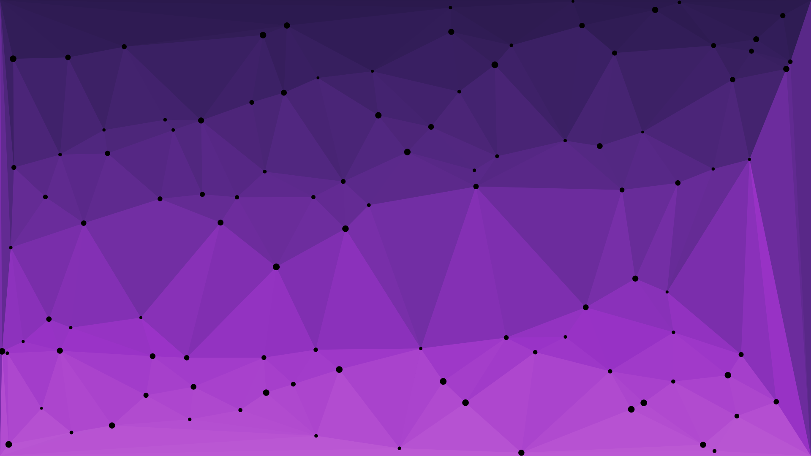

# react-triangulate
Simple Delauney triangulation example with animation.
Triangle points are generated using [delaunator](https://www.npmjs.com/package/delaunator).

[DEMO](https://xteamstanly.github.io/react-triangulate/)

## Preview

## Triangulate properties
| Prop                |    Type    | Definition                                                           | Default value |
|---------------------|:----------:|----------------------------------------------------------------------|:-------------:|
| topcolor            |   string   | Top gradient color.                                                  |    #221A33    |
| botcolor            |   string   | Bottom gradient color.                                               |    #8A3D99    |
| pointscolor         |   string   | Color of triangle points.                                            |    #000000    |
| mincirclesize       |   number   | Minimal triangle point size.                                         |       3       |
| maxcirclesize       |   number   | Maximal triangle point size.                                         |       8       |
| count               |   number   | Number of triangle points.                                           |      100      |
| minspeed            |   number   | Minimal speed of a triangle point.                                   |      0.1      |
| maxspeed            |   number   | Maximal speed of a triangle point.                                   |      0.5      |
| pointshadowblur     |   number   | Blur strength around tringle points (shadow).                        |       0       |
| pointshadowcolor    |   string   | Blur color around a triangle points.                                 |   #00000000   |
| colorvariance       |   boolean  | Should triangle points be a different color?                         |     false     |
| tint                | percentage | Triangle points color tint.                                          |       0       |
| shade               | percentage | Triangle points color shade.                                         |       1       |
| triangleshadowblur  |   number   | Blur strength inside a triangle (50 looks like a nice inner shadow). |       0       |
| triangleshadowcolor |   string   | Blur color inside a triangle.                                        |   #00000000   |
| linewidth           |   number   | Width of a line connecting triangle points.                          |      1.0      |
| linecolor           |   string   | Color of a line connecting triangle points.                          |   #00000000   |
| fps                 |   number   | Frames per second limit.                                             |       60      |
| backgroundcolor     |   string   | Background canvas color - fallback!                                  |   #00000000   |
| fadecolor           |   string   | Fade color when resizing window.                                     |    #221A33    |
| stretching          |   boolean  | Does the canvas stretch during window resize?                        |     false     |

## Todo
- make a non-intrusive control panel for customisation
